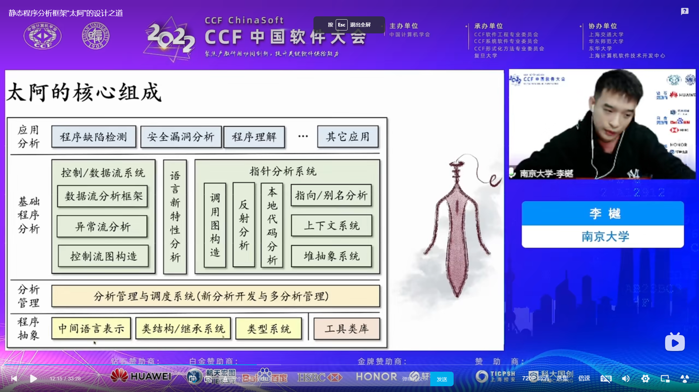

# usap
Theory + practice, the goal is to create a universal static analysis program.

# 1、如何运行
### 按照下图的步骤设置运行参数即可运行，该参数可扫描一个Log4Shell漏洞。

# 2、目录简介

原项目为[pascal-lab/Tai-e: An easy-to-learn/use static analysis framework for Java (github.com)](https://github.com/pascal-lab/Tai-e)

~~~
├── doc                        （个人整理的参考文档，不定时更新）
├── java-benchmarks            （需要用到的jre和一个完整的测试靶场）
├── lib                        （部分soot源码文件修改编译后的jar包）
├── src
   ├── main
      ......
         ├── analysis          （核心目录，指针分析、污点分析等)  
         ├── config            （命令行参数、分析配置等）
         ├── frontend          （soot转换）
         ├── ir                （中间表示）
         ├── language          （java、jvm建模）
         ├── util              （工具库）
         ├── Main              （主程序入口）
         ......
~~~

# 3、写给读者
该项目的意义在于抹平信息差，许多开发白盒工具的程序员对静态程序分析理论停留在百度出来的只言片语和《编译原理》的复杂且简短的描述中，没有一个系统性的认识，其实这是一门大学的选修课程，名字也不叫静态程序分析而是叫《软件分析》。如果你不知道半格、不动点、may/must是什么意思，说明你还没有入门。《软件分析》里所用到的技术和原理基本出自《编译原理》，所以大家搜到《编译原理》看到目录时一般就会止步于此了，但是《编译原理》复杂又难懂而且后半本基本上是研究生学习的内容，坑就坑在白盒工具需要的内容大部分在后半本。

下面是《软件分析》课程的链接，由于我只看过南京大学的课程，所以下面都课程描述都是南大的。细心的小伙伴可能会发现《编译原理》也是南京大学翻译的。
~~~
   南京大学《软件分析》课程：
   https://www.bilibili.com/video/BV1b7411K7P4/?spm_id_from=333.788
   
   北京大学《软件分析》课程：
   https://www.bilibili.com/video/BV14X4y1N7nx/?spm_id_from=333.337.search-card.all.click&vd_source=7681cd686b82133405d474c0c089507c
~~~

该课程是由南京大学计算机系的谭添和李樾老师共同讲授，分理论和实践两部分，理论6节，实践10节，每节2小时。每天看一节半个月就可以看完了，这门课程的理论部分是李樾老师教授，因为授课ppt是全英文的，需要你有一点英语阅读能力，还需要你有一点关于集合的数学基础和一些《编译原理》的基础概念，都没有也没关系，多看几遍就会了。由于知识是存在连贯性的请务必看完基础理论部分。

实践部分由谭添老师教授，这部分非常重要，因为该项目就是由谭添老师独自设计开发的，课程中的模型都在项目中实现了，项目名称为Tai-e，下图是它的架构图。污点分析只是这个框架的一个应用，在项目中作为一个插件存在，Tai-e的污点分析是一个流不敏感（没有控制流）的框架（提升不大），可通过配置使用上下文敏感/不敏感模型。这个项目最有意思的一个地方在于反射分析，可以分析java中的反射调用，要知道现在的框架大量使用反射，这种分析方法也是两位老师在14年提出的，这种方法在课程当中也有描述。除此之外，这门课程非常贴心的为你准备了实验作业，记得按时写作业。

~~~

Tai-e设计之道：
https://www.bilibili.com/video/BV1XP4y1S7cP/?spm_id_from=333.788&vd_source=7681cd686b82133405d474c0c089507c

Tai-e项目地址：
https://github.com/pascal-lab/Tai-e

Tai-e作业：
https://tai-e.pascal-lab.net/intro/overview.html

Tai-e项目文档：
https://tai-e.pascal-lab.net/docs/index.html

~~~

我所做的工作只是为程序添加注释和参考文档，可以省去你查阅大量资料和思考的时间，考虑到大部分人只用Maven，我把构建工具由gradle改成了Maven。Tai-e是一个非常值得学习的项目，所引用的外部库寥寥无几，你可以学习到大量的数据结构应用、函数式编程、设计模式，jvm规范等，其中函数式编程在项目中应用最为广泛，老师的编码习惯让我一度以为java是一门函数式语言，这也很好理解，研究编程语言的最后的归宿都是函数式语言，看到这的读者有时间一定要学习一门函数式语言如Rust、ocaml，你会发现函数式语言天生就适合干解析语言的工作，因为都内含递归性。

# 4、关于构建一个多语言的静态分析程序

由于Tai-e的前端是建立在soot上的，所有的词法、语法分析，中间代码转换工作都发生在soot上，而soot是专门为解析java开发的，想要够建一个多语言的静态分析程序，你需要找到其他语言里类似soot的工具。虽然soot是开源的，但是你不要想着照葫芦画瓢自己写一个其他语言的soot出来，所需要的知识量远超你的想象，这句话有点多余了。

老师在课程中反复说这些模型和方法在面向对象语言中如何如何，如果你要构建其他类型的语言，可能课程里的模型和方法就不太适用了，需要你去找其他资料了。

当然github上也有开源的多语言白盒工具，我所知道的只有Semgrep，前身是facebook的pfff，Semgrep是一个采用函数式编程语言ocaml编写的程序，该语言有个很坑的点，你只能在命令行中打断点调试，不像其他语言那么方便，它的底层使用Tree-sitter作为多语言的解析器，和java中的Antrl类似，可以将语言解析成抽象语法树，然后Semgrep再解析抽象语法树生成中间语言，再构建控制流图，最后应用转换函数和指针分析，如果你看过《软件分析》你就知道这个过程是标准的静态分析过程，里面的变量名也非常眼熟。如果你使用过Semgrep的话，它的规则编写界面所编写的规则具有强大的模式识别能力，这是一种结构搜索技术，我们常用的idea中就有这样的功能  IDEA Edit菜单 —— Find —— Search Structurally...。当然github也有这样的开源组件，使用函数式语言Rust编写的[ast-grep/ast-grep: ⚡A CLI tool for code structural search, lint and rewriting. Written in Rust (github.com)](https://github.com/ast-grep/ast-grep)。虽然Semgrep是开源的，但是能让它跑起来也有点难，因为中国没有多少ocaml的资料，让Semgrep跑起来老费劲了。下面是我总结的编译过程和学习资料。

~~~

Centos7 编译与调试 semgrep 1.19 源码:
https://blog.csdn.net/wjz520241/article/details/132140792

centos7安装ocaml：
https://blog.csdn.net/wjz520241/article/details/130348973

OCaml官网：
https://ocaml.org

~~~

