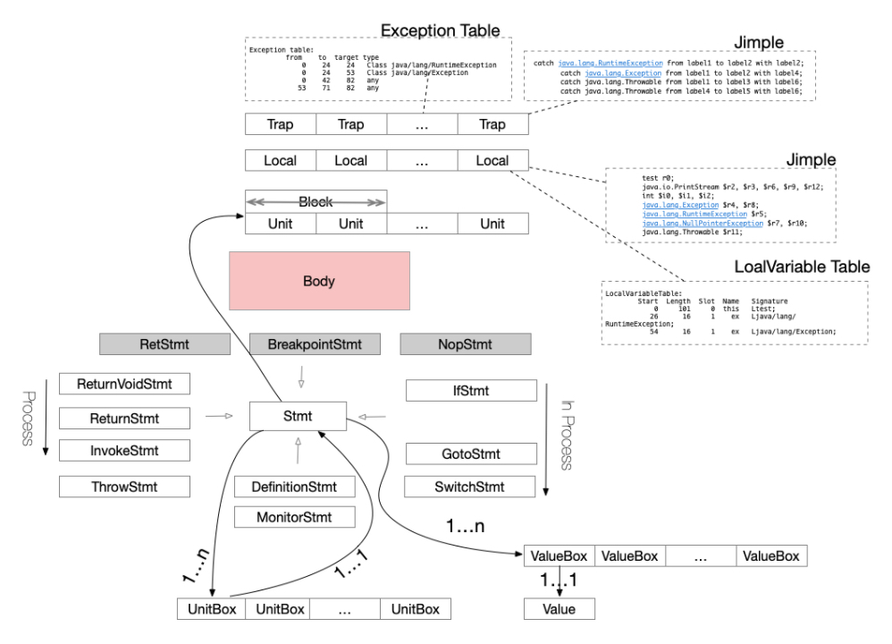

# Soot IR简介

上图是soot的基本数据结构Body，一个Body隶属于一个SootMethod（表示一个类中的单个方法），即soot用一个Body为一个方法存储代码，分析应用可以使用Body访问各种信息，如一组声明的局部变量、方法体内语句、以及方法体内处理的异常。

在soot中，方法体内的语句都存在Unit中，Unit语句在其中的主流IR Jimple中就是Stmt，主要的Stmt如下。

*Jimple Stmt类型*
- 核心语句 ： NopStmt，IdentityStmt，AssignStmt
- 负责过程内控制流 ：IfStmt , GotoStmt , SwitchStmt
- 负责过程间的控制流 ：InvokeStmt ，ReturnStmt，ReturnVoidStmt，ThrowStmt
- 监控语句 （多线程）：MonitorStmt
- 赋值语句 ：DefinitionStmt
- 其它类型 ：BreakponitStmt
- 已经不使用的语句 ：RetStmt

还有Expr，Host类型，都在soot/jimple/internal目录下，总体来看比我见过的很多IR都简洁，毕竟各个项目的需求不一样，大多数IR都是根据语言的产生式编写的，描述的是语言的所有细节，静态分析不需要那么多细节，三大类型只有50到60个文件的样子比其他全细节的IR（如Antlr的java语法文件）少了一个数量级。这也从侧面回答了一个问题，如果你自己开发的IR想要更多的细节，就要向全细节IR的方向靠拢进行抽象设计。

# 项目IR

项目中的IR是由南京大学的计算机系副教授 *谭添* 老师设计开发的，他在课中提到soot现有的IR不足以支撑更精确的分析所以写了自己的IR，其中Stmt模型像是他讲课的四条核心语句和Jimple的混合产物。

*Stmt模型：*
- new语句 ：New
- assign语句 ：AssignLiteral，Copy，Binary，Unary
- load语句 ：LoadArray，LoadField
- store语句 ： StoreArray，StoreField

- 负责过程内控制流 ：Catch，If，Goto，TableSwitch，LookupSwitch
- 负责过程间的控制流 ：Invoke，Return，Throw
- 监控语句 ：Monitor
- 其它类型 ：Nop，Cast，InstanceOf

*Exp模型*
- 一元表达式 ：ArrayLengthExp（数组长度）、NegExp（负数表达式）
- 二元表达式 ：ArithmeticExp（算数表达式，加减等）、BitwiseExp（位操作表达式，与或等）、ConditionExp（条件表达式，大于等）、ComparisonExp（比较表达式，用于比较数值）、ShiftExp（位移表达式，左右位移）
- New表达式：NewInstance、NewArray、NewMultiArray（多维数组）
- 字面量：以Literal结尾的类，数字基本类型+数字包装类型+null+String+class+Method
- 字段访问 ：InstanceFieldAccess（实例字段访问）、StaticFieldAccess（静态字段访问）
- 调用表达式 （参考方法调用图）：InvokeInterface、InvokeSpecial、InvokeStatic、InvokeVirtual

实际上谭添老师的这个IR除了四条核心语句外，大部分或功能类似的类，都在soot的Jimple中出现过或是在soot的Grimp中出现过，应该是在soot的基础上加上了自己授课的模型。都是解析soot字节码区别不大很正常。